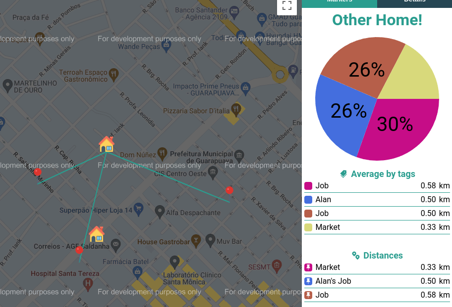
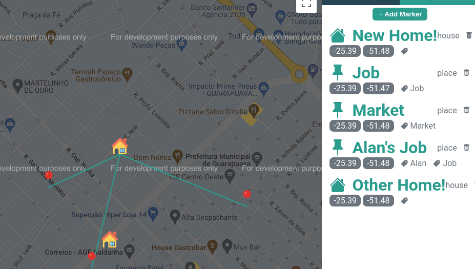
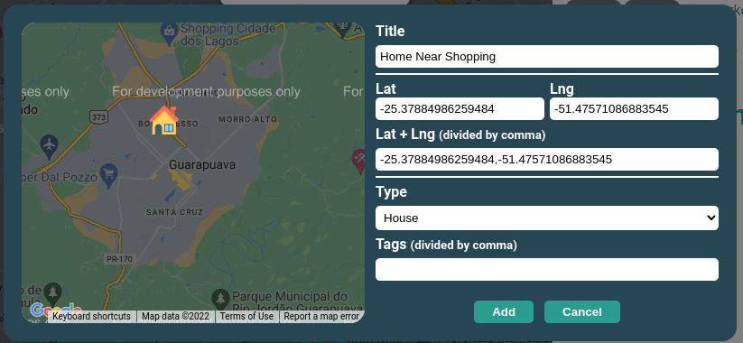

<h1 align="center">Distancier</h1>



<p align="center">
    <span></span>
    <span></span>
</p>

---

- [About](#about)
- [Runnig the project](#runnig-the-project)
- [Future ideas](#future-ideas)
- [Credits](#credits)
- [Assets](#assets)

# About

Simple web app to pick a new house, and check which one is better by checking the distance between places.

# Runnig the project

Add your Google Maps API Key in `.env.local`. _(Check the `.env.example`)_

Run the project in a development environment with:
```
$ yarn dev
```

# Future ideas

- [ ] Use Google's Geocode to find coordinates easier
- [ ] Use Google's street to correct show path between houses and places
- [ ] Use Google's DistanceMatrix to correct calculate distance between houses and places _(currently calculating distance in simple straight line)_

# Credits

| who                    | what            |
| ---------------------- | --------------- |
| Peterson Adami Candido | Design + Coding |

# Assets
| asset     | where                                           |
| --------- | ----------------------------------------------- |
| Home Icon | https://www.flaticon.com/free-icon/house_609803 |
| Pin Icon  | https://www.flaticon.com/free-icon/pin_149059   |